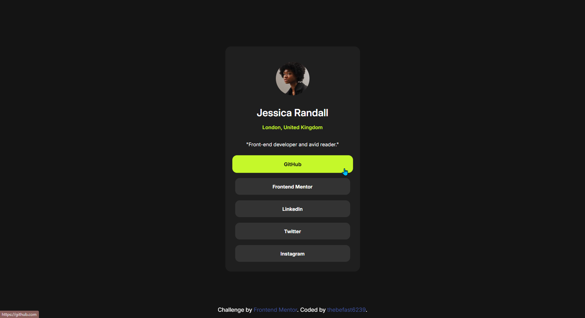

# Frontend Mentor - Social links profile solution

This is a solution to the [Social links profile challenge on Frontend Mentor](https://www.frontendmentor.io/challenges/social-links-profile-UG32l9m6dQ). Frontend Mentor challenges help you improve your coding skills by building realistic projects. 

## Table of contents

- [Overview](#overview)
  - [Screenshot](#screenshot)
  - [Links](#links)
- [My process](#my-process)
  - [Built with](#built-with)
  - [What I learned](#what-i-learned)
- [Author](#author)

## Overview

### Screenshot



### Links

- Solution URL: [github repo](https://github.com/thebefast6239/social-links-profile-main)
- Live Site URL: [github io](https://thebefast6239.github.io/social-links-profile-main)

## My process

### Built with

- Semantic HTML5 markup
- CSS custom properties
- Flexbox
- Mobile-first workflow

### What I learned

I used “CSS Variables + Reset” method

Learned "transform"&"transition" effect
```css
.sc-media-button {
  background-color: var(--grey-700);
  transition: background-color 0.3s ease, color 0.15s ease, transform 0.3s ease;
}
.sc-media-button:hover{
  background-color: var(--green);
  transform: scale(105%);
}
.sc-media-button:active {
  transform: scale(0.97);
}
```

## Author

- Website - [thebefast6239](https://github.com/thebefast6239)
- Discord - [a0s9d8f7g6h5j4k3l2](https://discord.gg)